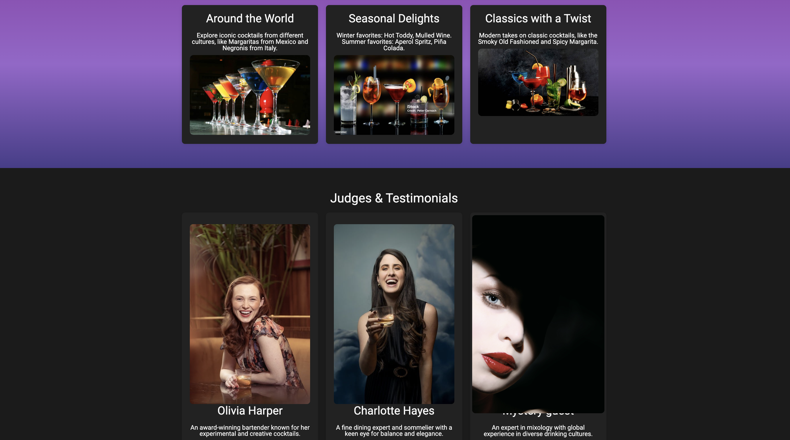

# 🥂 Shake & Stir Awards

A celebration of creativity, craftsmanship, and the art of mixology. This vibrant event showcases aspiring bartenders and seasoned cocktail artists through an engaging competition set in an unforgettable coastal atmosphere.

---

## 🌐 Live Demo

[Click to view the project](https://ileanacamelia.github.io/shake-and-stir-awards/)

---

## 🖼️ Project Preview

### Hero Section

### Gallery Section

---

## 🔧 Technologies Used

- **HTML5** – semantic structure and accessibility  
- **CSS3** – responsive layout using **CSS Grid**, modern styling, gradients  
- **Responsive Design** – adaptable layout across screen sizes  

---

## 🎯 Features

- 🏆 **Signature Creations** section featuring custom cocktails with names and recipes  
- 🍹 **Categories** such as “Seasonal Delights” and “Classics with a Twist”  
- 🧑‍⚖️ **Judges & Testimonials** highlighting industry experts  
- 💬 Clean navigation bar with anchor links for easy section jumps  
- 🎨 Gradient backgrounds and aesthetic contrast between sections  

---

## 🗂️ Project Structure

